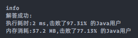

### `leetcode - 10 正则表达式匹配`

#### 题目描述

> 给你一个字符串 s 和一个字符规律 p，请你来实现一个支持 `'.'` 和 `'*'` 的正则表达式匹配。
>
> `'.'` 匹配任意单个字符
> `'*'` 匹配零个或多个前面的那一个元素
>
>
> 所谓匹配，是要涵盖 整个 字符串 s的，而不是部分字符串。
>
> *   示例 1：
>
>     ```
>     输入：s = "aa" p = "a"
>     输出：false
>     解释："a" 无法匹配 "aa" 整个字符串。
>     ```
>
> *   示例 2:
>
>     ```
>     输入：s = "aa" p = "a*"
>     输出：true
>     解释：因为 '*' 代表可以匹配零个或多个前面的那一个元素, 在这里前面的元素就是 'a'。因此，字符串 "aa" 可被视为 'a' 重复了一次。
>     ```
>
> *   示例 3：
>
>     ```
>     输入：s = "ab" p = ".*"
>     输出：true
>     解释：".*" 表示可匹配零个或多个（'*'）任意字符（'.'）。
>     ```
>
> *   示例 4：
>
>     ```
>     输入：s = "aab" p = "c*a*b"
>     输出：true
>     解释：因为 '*' 表示零个或多个，这里 'c' 为 0 个, 'a' 被重复一次。因此可以匹配字符串 "aab"。
>     ```
>
> *   示例 5：
>
>     ```
>     输入：s = "mississippi" p = "mis*is*p*."
>     输出：false
>     ```
>
> *   提示：
>     *   `0 <= s.length <= 20`
>     *   `0 <= p.length <= 30`
>     *   s 可能为空，且只包含从 a-z 的小写字母。
>     *   p 可能为空，且只包含从 a-z 的小写字母，以及字符 . 和 *。
>     *   保证每次出现字符 * 时，前面都匹配到有效的字符
>
> *   Related Topics 递归 字符串 动态规划
> *   👍 2277 👎 0

#### 我的题解

```java
class Solution {
    public boolean isMatch(String s, String p) {
        if (s == null || p == null) {
            return false;
        }

        int len = s.length(), patLen = p.length();

        // dp状态描述为：从头到位匹配，进行到到s[i]与p[j]时是否匹配
        boolean[][] dp = new boolean[len + 1][patLen + 1];

        dp[0][0] = true;
        for (int i = 1; i <= patLen; i++) {
            if (p.charAt(i - 1) == '*') {
                dp[0][i] = dp[0][i - 2];
            }
        }

        for (int i = 1; i <= len; i++) {
            for (int j = 1; j <= patLen; j++) {
                if (s.charAt(i - 1) == p.charAt(j - 1) || p.charAt(j - 1) == '.') {
                    // 当前字符匹配（字符相同或为'.'），沿用s[i - 1]与p[j - 1]匹配到的状态
                    dp[i][j] = dp[i - 1][j - 1];
                } else if (p.charAt(j - 1) == '*') {
                    // 当前字符不匹配但模式串对应字符为'*'，分为以下情况
                    if (s.charAt(i - 1) == p.charAt(j - 2) || p.charAt(j - 2) == '.') {
                        // 目标串符合'*'通配的要求（字符相同或为'.'），有以下三种情况
                        //     1. dp[i][j-2], 即p[j-1]没有出现（s: "aa", p: "ab*a"）,取s当前位置遇到通配之前的状态
                        //     2. dp[i-1][j-2], 即p[j-1]出现一次（s: "aba", p: "ab*a"）,取s上一位置遇到通配之前的状态
                        //     3. dp[i-1][j], 即p[j-1]出现>=2次（s: "abbb....a", p: "ab*a"），取s上一位置遇到通配时的状态（逻辑上讲，会递归地找到所有对应这次通配的字符之前的状态）
                        dp[i][j] = dp[i][j - 2] || dp[i - 1][j - 2] || dp[i - 1][j];
                    } else {
                        // 目标串中没有符合这个通配的子串，这个状态取决于这个通配开始之前的状态
                        dp[i][j] = dp[i][j - 2];
                    }
                }
            }
        }

        return dp[len][patLen];
    }
}
```

