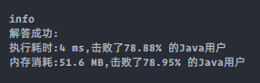

### `leetcode - 11 盛最多水的容器`

#### 题目描述

> 给你 n 个非负整数 a<sub>1</sub>，a<sub>2</sub>，...，a<sub>n</sub>，每个数代表坐标中的一个点 (i, a<sub>i</sub>) 。在坐标内画 n 条垂直线，垂直线 i 的两个端点分别为 (i, a<sub>i</sub>) 和 (i, 0) 。找出其中的两条线，使得它们与 x 轴共同构成的容器可以容纳最多的水。
>
> 说明：你不能倾斜容器。
>
> 
>
> *   示例 1：
>
>     ```
>     输入：[1,8,6,2,5,4,8,3,7]
>     输出：49
>     解释：图中垂直线代表输入数组 [1,8,6,2,5,4,8,3,7]。在此情况下，容器能够容纳水（表示为蓝色部分）的最大值为 49。
>     ```
>
> *   示例 2：
>
>     ```
>     输入：height = [1,1]
>     输出：1
>     ```
>
> *   示例 3：
>
>     ```
>     输入：height = [4,3,2,1,4]
>     输出：16
>     ```
>
> *   示例 4：
>
>     ```
>     输入：height = [1,2,1]
>     输出：2
>     ```
>
> 
>
> *   提示：
>     *   n = height.length
>     *   2 <= n <= 3 * 104
>     *   0 <= height[i] <= 3 * 104
>
> *   Related Topics 贪心 数组 双指针
> *   👍 2671 👎 0

#### 我的题解

```java
class Solution {
    public int maxArea(int[] height) {
        int ans = 0;
        for (int i = 0; i < height.length; i++) {
            for (int j = i + 1; j < height.length; j++) {
                int distance = j - i;
                int h = Math.min(height[i], height[j]);
                ans = Math.max(ans, h * distance);
            }
        }
        return ans;
    }
}
```

#### 可改进的点

> * 超时，时间复杂度O(N<sup>2</sup>)
> * 贪心，双指针分别指向数组两端，每次记录以指向的值为容器壁可容纳的最多水量并求最大值，将较小的一边向里收缩，再次记录后在将较小的收缩，直到两边相遇。最大值即为答案。
> * 贪心的思想是将大问题分解为若干个子问题，每次求得当前子问题的最优解，所有子问题的最优解中最优的即为大问题的最优解。

#### 改进

```java
class Solution {
    public int maxArea(int[] height) {
        int ans = 0;
        int l = 0, r = height.length - 1;
        while (l < r) {
            ans = Math.max(ans, Math.min(height[l], height[r]) * (r - l));
            if (height[l] > height[r]) {
                r--;
            } else {
                l++;
            }
        }
        return ans;
    }
}
```

