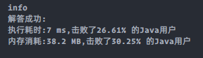

### `leetcode - 12 整数转罗马数字`

#### 题目描述

> 罗马数字包含以下七种字符： I， V， X， L，C，D 和 M。
>         
>         
>
> | 字符 | 数值 |
> | :--: | :--: |
> |  I   |  1   |
> |  V   |  5   |
> |  X   |  10  |
> |  L   |  50  |
> |  C   | 100  |
> |  D   | 500  |
> |  M   | 1000 |
>
>
> 例如， 罗马数字 2 写做 `II` ，即为两个并列的 1。12 写做 `XII`，即为 `X` + `II` 。 27 写做 `XXVII`, 即为 `XX` + `V` + `II` 。
>         
> 通常情况下，罗马数字中小的数字在大的数字的右边。但也存在特例，例如 4 不写做 `IIII`，而是 `IV`。数字 1 在数字 5 的左边，所表示的数等于大数 5
> 减小数 1 得到的数值 4 。同样地，数字 9 表示为 IX。这个特殊的规则只适用于以下六种情况：
>         
>         
> I 可以放在 V (5) 和 X (10) 的左边，来表示 4 和 9。
> X 可以放在 L (50) 和 C (100) 的左边，来表示 40 和 90。
> C 可以放在 D (500) 和 M (1000) 的左边，来表示 400 和 900。
>         
>         
> 给你一个整数，将其转为罗马数字。
>         
>         
>         
>
> *   示例 1:
>
>     ```
>     输入: num = 3
>     输出: "III"        
>     ```
>
> *   示例 2:
>
>     ```
>     输入: num = 4
>     输出: "IV"
>     ```
>
> *   示例 3:
>
>     ```
>     输入: num = 9
>     输出: "IX"
>     ```
>
> *   示例 4:
>
>     ```
>     输入: num = 58
>     输出: "LVIII"
>     解释: L = 50, V = 5, III = 3.
>     ```
>
> *   示例 5:
>
>     ```
>     输入: num = 1994
>     输出: "MCMXCIV"
>     解释: M = 1000, CM = 900, XC = 90, IV = 4.
>     ```
>
>     
>     ​        
>
> *   提示：
>
>     *   `1 <= num <= 3999`
>
> *   Related Topics 哈希表 数学 字符串
>
> *   👍 668 👎 0

#### 我的题解

```java
class Solution {
    private static final String[] O = {"I", "X", "C", "M"};
    private static final String[] F = {"V", "L", "D"};

    public String intToRoman(int num) {
        int crt, index = 0;
        StringBuilder ans = new StringBuilder();
        while (num > 0) {
            crt = num % 10;
            StringBuilder crtStr = new StringBuilder();
            if (crt == 9) {
                crtStr = new StringBuilder(O[index] + O[index + 1]);
                crt = 0;
            } else if (crt >= 5) {
                crtStr = new StringBuilder(F[index]);
                crt -= 5;
            } else if (crt == 4) {
                crtStr = new StringBuilder(O[index] + F[index]);
                crt = 0;
            }
            crtStr.append(O[index].repeat(crt));
            ans.insert(0, crtStr);

            num /= 10;
            index++;
        }
        return ans.toString();
    }
}
```


