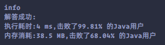

### `leetcode - 13 罗马数字转整数`

#### 题目描述

> 罗马数字包含以下七种字符: I， V， X， L，C，D 和 M。
>
> | 字符 | 数值 |
> | :--: | :--: |
> |  I   |  1   |
> |  V   |  5   |
> |  X   |  10  |
> |  L   |  50  |
> |  C   | 100  |
> |  D   | 500  |
> |  M   | 1000 |
>
> 例如， 罗马数字 2 写做 II ，即为两个并列的 1。12 写做 XII ，即为 X + II 。 27 写做 XXVII, 即为 XX + V + I
> I 。
>
> 通常情况下，罗马数字中小的数字在大的数字的右边。但也存在特例，例如 4 不写做 IIII，而是 IV。数字 1 在数字 5 的左边，所表示的数等于大数 5
> 减小数 1 得到的数值 4 。同样地，数字 9 表示为 IX。这个特殊的规则只适用于以下六种情况：
>
>
> I 可以放在 V (5) 和 X (10) 的左边，来表示 4 和 9。
> X 可以放在 L (50) 和 C (100) 的左边，来表示 40 和 90。
> C 可以放在 D (500) 和 M (1000) 的左边，来表示 400 和 900。
>
>
> 给定一个罗马数字，将其转换成整数。输入确保在 1 到 3999 的范围内。
>
> 
>
> *   示例 1:
>
>     ```
>     输入: "III"
>     输出: 3
>     ```
>
> *   示例 2:
>
>     ```
>     输入: "IV"
>     输出: 4
>     ```
>
> *   示例 3:
>
>     ```
>     输入: "IX"
>     输出: 9
>     ```
>
> *   示例 4:
>
>     ```
>     输入: "LVIII"
>     输出: 58
>     解释: L = 50, V= 5, III = 3.
>     ```
>
> *   示例 5:
>
>     ```
>     输入: "MCMXCIV"
>     输出: 1994
>     解释: M = 1000, CM = 900, XC = 90, IV = 4.
>     ```
>
>     
>
> 
>
> *   提示：
>     *   1 <= s.length <= 15
>     *   s 仅含字符 ('I', 'V', 'X', 'L', 'C', 'D', 'M')
>     *   题目数据保证 s 是一个有效的罗马数字，且表示整数在范围 [1, 3999] 内
>     *   题目所给测试用例皆符合罗马数字书写规则，不会出现跨位等情况。
>     *   IL 和 IM 这样的例子并不符合题目要求，49 应该写作 XLIX，999 应该写作 CMXCIX 。
>     *   关于罗马数字的详尽书写规则，可以参考 罗马数字 - Mathematics 。
>
> *   Related Topics 哈希表 数学 字符串
> *   👍 1439 👎 0

#### 我的题解

```java
class Solution {
    private static final Map<Character, Integer> map = new HashMap<>() {{
        put('I', 1);
        put('V', 5);
        put('X', 10);
        put('L', 50);
        put('C', 100);
        put('D', 500);
        put('M', 1000);
    }};

    public int romanToInt(String s) {
        int ans = 0, last = map.get(s.charAt(0));
        for (int i = 1; i < s.length(); i++) {
            int temp = map.get(s.charAt(i));
            ans = last >= temp ? ans + last : ans - last;
            last = temp;
        }
        ans += last;
        return ans;
    }
}
```


