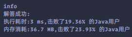

### `leetcode - 14 最长公共前缀`

#### 题目描述

> 编写一个函数来查找字符串数组中的最长公共前缀。
>         
> 如果不存在公共前缀，返回空字符串 ""。
>         
>         
>         
>
> *   示例 1：
>
>     ```
>     输入：strs = ["flower","flow","flight"]
>     输出："fl"
>     ```
>
>     
>
> *   示例 2：
>
>     ```
>     输入：strs = ["dog","racecar","car"]
>     输出：""
>     解释：输入不存在公共前缀。
>     ```
>
> 
>
> 
>
> *   提示：
>     *   `1 <= strs.length <= 200`
>     *   `0 <= strs[i].length <= 200`
>     *   strs[i] 仅由小写英文字母组成
>                 
> *   Related Topics 字符串
> *   👍 1721 👎 0

#### 我的题解

```java
class Solution {
    public String longestCommonPrefix(String[] strs) {
        StringBuilder stringBuilder = new StringBuilder();
        int len = Arrays.stream(strs).min(Comparator.comparingInt(String::length)).map(String::length).orElse(0);
        if (len == 0) {
            return "";
        }

        for (int i = 0; i < len; i++) {
            char c = strs[0].charAt(i);
            boolean flag = false;
            for (int j = 1; j < strs.length; j++) {
                if (c != strs[j].charAt(i)) {
                    flag = true;
                    break;
                }
            }
            if (flag) {
                break;
            }
            stringBuilder.append(c);
        }

        return stringBuilder.toString();
    }
}
```


