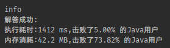

### `leetcode - 15 三数之和`

#### 题目描述

> 给你一个包含 n 个整数的数组 nums，判断 nums 中是否存在三个元素 a，b，c ，使得 a + b + c = 0 ？请你找出所有和为 0 且不重
> 复的三元组。
>         
> 注意：答案中不可以包含重复的三元组。
>         
>         
>         
>
> *   示例 1：
>
>     ```
>     输入：nums = [-1,0,1,2,-1,-4]
>     输出：[[-1,-1,2],[-1,0,1]]
>     ```
>
> *   示例 2：
>
>     ```
>     输入：nums = []
>     输出：[]
>     ```
>
>     
>
> *   示例 3：
>
>     ```
>     输入：nums = [0]
>     输出：[]
>     ```
>
>     ​        
>
>     
>
> *   提示：
>
>     *   `0 <= nums.length <= 3000`
>     *   -10<sup>5</sup> <= nums[i] <= 10<sup>5</sup>        
>
>     
>
> *   Related Topics 数组 双指针 排序
>     👍 3619 👎 0

#### 我的题解

```java
class Solution {
    public List<List<Integer>> threeSum(int[] nums) {

        List<List<Integer>> ans = new ArrayList<>();

        Arrays.sort(nums);
        for (int i = 0; i < nums.length; i++) {
            int x = nums[i];
            if (x > 0) {
                return ans;
            }
            if (i > 0 && nums[i] == nums[i - 1]) {
                continue;
            }
            for (int j = i + 1; j < nums.length; j++) {
                int y = nums[j], l = j + 1;
                if (x + y > 0) {
                    break;
                }
                if (j > i + 1 && nums[j] == nums[j - 1]) {
                    continue;
                }
                while (l < nums.length) {
                    int z = nums[l];
                    if (x + y + z == 0) {
                        ans.add(Arrays.asList(x, y, z));
                        break;
                    } else if (x + y + z > 0) {
                        break;
                    }
                    l++;
                }
            }
        }
        return ans;
    }
}
```

