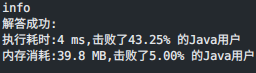
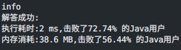

### `leetcode - 1 两数之和`

#### 题目描述

> 给定一个整数数组 `nums` 和一个整数目标值 `target`，请你在该数组中找出 和为目标值 `target `的那两个整数，并返回它们的数组下标。
>
>   你可以假设每种输入只会对应一个答案。但是，数组中同一个元素在答案里不能重复出现。
>
>   你可以按任意顺序返回答案。
>
>   示例 1：
> 输入：nums = [2,7,11,15], target = 9
>
> 输出：[0,1]
>
> 解释：因为 nums[0] + nums[1] == 9 ，返回 [0, 1] 。
>
>   示例 2：
>
> 输入：nums = [3,2,4], target = 6
>
> 输出：[1,2]
>
>   示例 3：
>
> 输入：nums = [3,3], target = 6
>
> 输出：[0,1]
>
>   提示：
>
> 2 <= `nums.length` <= 10^4^
>
> -10^9^ <= `nums[i]` <= 10^9^
>
> -10^9^ <= `target `<= 10^9^
>
> 只会存在一个有效答案
>
>   进阶：你可以想出一个时间复杂度小于 O(n^2^) 的算法吗？
> Related Topics 数组 哈希表
> 👍 11629 👎 0

#### 我的题解

```java
/**
 * 思路: 求数组中相加为target的[两个]值的索引，进阶要求时间复杂度小于O(n^2)
 * 考虑打表，记录每个数最后一次出现的索引，数组每项取值+-1e9，用桶数组存需要的空间过大，考虑Map
 * 用Map可以解决，开始编码
 */

import java.util.HashMap;

class Solution {
    public int[] twoSum(int[] nums, int target) {
        Map<Integer, Integer> map = new HashMap<>();
        // 打表，保存每个数最后出现的位置
        for (int i = 0; i < nums.length; i++) {
            map.put(nums[i], i);
        }
        for (int i = 0; i < nums.length; i++) {
            int aim = target - nums[i];
            // 查找是否有符合的项，若存在符合的数但索引和当前位置相同，则说明若该项作为答案则一个元素出现两次，排除
            if (map.containsKey(aim) && map.get(aim) != i) {
                return new int[]{i, map.get(aim)};
            }
        }
        // 因为一定存在答案，这里不用考虑
        return null;
    }
}
```



#### 最优解

```java
class Solution {
    public int[] twoSum(int[] nums, int target) {
        Map<Integer, Integer> hashtable = new HashMap<Integer, Integer>();
        for (int i = 0; i < nums.length; ++i) {
            if (hashtable.containsKey(target - nums[i])) {
                return new int[]{hashtable.get(target - nums[i]), i};
            }
            hashtable.put(nums[i], i);
        }
        return new int[0];
    }
}
```

#### 可改进的点

> * 应该从打表时就开始搜索答案，看已打的表是否有符合答案者，如此若在打表前期找到答案，可以省去后面的打表时间和空间。目前的方法时间复杂度固定`O(n + [1, n])`，优化后可达到`O([1, n])`

#### 改进

```java
class Solution {
    public int[] twoSum(int[] nums, int target) {
        Map<Integer, Integer> map = new HashMap<>();
        for (int i = 0; i < nums.length; i++) {
            int aim = target - nums[i];
            if (map.containsKey(aim) && map.get(aim) != i) {
                return new int[]{i, map.get(aim)};
            } else {
                map.put(nums[i], i);
            }
        }
        return null;
    }
}
```


