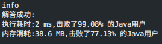

### `leetcode - 2 两数相加`

#### 题目描述

> 给你两个非空的链表，表示两个非负的整数。它们每位数字都是按照 逆序 的方式存储的，并且每个节点只能存储 一位 数字。
>
> 请你将两个数相加，并以相同形式返回一个表示和的链表。
>
> 你可以假设除了数字 0 之外，这两个数都不会以 0 开头。
>
> 
>
> 示例 1：
>
>
> 输入：l1 = [2,4,3], l2 = [5,6,4]
> 输出：[7,0,8]
> 解释：342 + 465 = 807.
>
>
> 示例 2：
>
>
> 输入：l1 = [0], l2 = [0]
> 输出：[0]
>
>
> 示例 3：
>
>
> 输入：l1 = [9,9,9,9,9,9,9], l2 = [9,9,9,9]
> 输出：[8,9,9,9,0,0,0,1]
>
> 
>
>
> 提示：
>
>
> 每个链表中的节点数在范围 [1, 100] 内
> 0 <= Node.val <= 9
> 题目数据保证列表表示的数字不含前导零
>
> Related Topics 递归 链表 数学
> 👍 6484 👎 0

#### 我的题解

```java
/**
 * 思路：链表相加向后进位，三个元素：加数1、加数2和进位，任意一个数不为0就可以继续运算，进位 = 和除以10向下取整，当前位置的值 = 和与10取模
 * 注意结果要把一开始占位的头结点去掉
 */

/**
 * Definition for singly-linked list.
 * public class ListNode {
 * int val;
 * ListNode next;
 * ListNode() {}
 * ListNode(int val) { this.val = val; }
 * ListNode(int val, ListNode next) { this.val = val; this.next = next; }
 * }
 */
class Solution {
    public ListNode addTwoNumbers(ListNode l1, ListNode l2) {
        ListNode ans = new ListNode(), cur = ans;
        int carry = 0;
        while (l1 != null || l2 != null || carry != 0) {
            int val1 = l1 != null ? l1.val : 0;
            int val2 = l2 != null ? l2.val : 0;

            int sum = val1 + val2 + carry;
            carry = sum / 10;

            if (l1 != null) {
                l1 = l1.next;
            }
            if (l2 != null) {
                l2 = l2.next;
            }

            cur.next = new ListNode(sum % 10);
            cur = cur.next;
        }
        return ans.next;
    }
}
```



