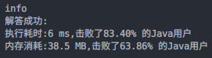
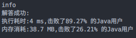

### `题目`

#### 题目描述

> 给定一个字符串 s ，请你找出其中不含有重复字符的 最长子串 的长度。
>
> 
>
> *   示例 1:
>     *   输入: s = "abcabcbb"
>     *   输出: 3
>     *   解释: 因为无重复字符的最长子串是 "abc"，所以其长度为 3。
>
> *    示例 2:
>     *   输入: s = "bbbbb"
>     *   输出: 1
>     *   解释: 因为无重复字符的最长子串是 "b"，所以其长度为 1。
>
> *    示例 3:
>     *   输入: s = "pwwkew"
>     *   输出: 3
>     *   解释: 因为无重复字符的最长子串是 "wke"，所以其长度为 3。
>              请注意，你的答案必须是 子串 的长度，"pwke" 是一个子序列，不是子串。
>
> *    示例 4:
>     *   输入: s = ""
>     *   输出: 0
>
> 
>
> *    提示：
>     *    0 <= s.length <= 5 * 104
>     *    s 由英文字母、数字、符号和空格组成
>
> *    Related Topics 哈希表 字符串 滑动窗口
>      👍 5796 👎 0

#### 我的题解

```java
/**
 * 滑动窗口问题，此处需要从每个起始点出发，寻找左边界为当前点的符合条件的最大窗口
 * 条件为窗口中不能出现重复字符
 * 窗口的右边界不需要缩小，因为找的是最大的长度，而左边界是不断向右的，当前右边界能找到的窗口就是最大的长度。
 * 步骤：左右边界从0开始，右边界先走，走到与窗口中字符重复为止，记录长度，然后收缩左边界，收缩到窗口中不存在与即将进入窗口的字符相同的字符为止，循环上述步骤，直到窗口滑出数组为止。输出最大值即可，本质上还是模拟。
 */

class Solution {
    public int lengthOfLongestSubstring(String s) {
        if (s == null || "".equals(s)) {
            return 0;
        }
        Set<Character> charSet = new HashSet<>();
        int ans = 0, right = -1;
        int n = s.length();
        for (int i = 0; i < n; i++) {
            if (i != 0) {
                charSet.remove(s.charAt(i - 1));
            }
            while (right + 1 < n && !charSet.contains(s.charAt(right + 1))) {
                charSet.add(s.charAt((right++) + 1));
            }
            ans = Math.max(ans, right - i + 1);
        }
        return ans;
    }
}
```



#### 可改进的点

> * 滑动窗口是按窗口边界一步一步收缩得到以每个点为起点的所有窗口长度后取最大值，这个过程会产生很多无用的答案，浪费时间，具体情况如：`abcdefgghijklmn`，第二次遇到`g`时，左边界还在`a`处，这时左边界会一步一步收缩到第二个g处，每次收缩都要尝试窗口是否符合要求，再取一次答案。
> * 解决方法：记录每次遇到一个字符时的位置，若遇到了相同字符，直接将窗口左边界定位到上一次该字符出现的位置之后即可。

#### 改进

```java
class Solution {
    public int lengthOfLongestSubstring(String s) {
        if (s == null || "".equals(s)) {
            return 0;
        }
        // 用map记录对应字符最后一次出现的位置
        Map<Character, Integer> charMap = new HashMap<>();
        int ans = 0, n = s.length();
        for (int i = 0, j = 0; j < n; j++) {
            char c = s.charAt(j);
            // 若将要进入窗口的字符在前面出现过，则直接将左边界置于该字母最后一次出现的位置之后
            if (charMap.containsKey(c)) {
                i = Math.max(i, charMap.get(c) + 1);
            }
            ans = Math.max(ans, j - i + 1);
            charMap.put(c, j);
        }
        return ans;
    }
}
```

