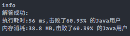

### `leetcode - 5 最长回文子串`

#### 题目描述

> 给你一个字符串 s，找到 s 中最长的回文子串。
>
> 
>
> *    示例 1：
>     *   输入：s = "babad"
>     *   输出："bab"
>     *   解释："aba" 同样是符合题意的答案。
>
> *    示例 2：
>     *   输入：s = "cbbd"
>     *   输出："bb"
>
> *    示例 3：
>     *   输入：s = "a"
>     *   输出："a"
>
> *    示例 4：
>     *   输入：s = "ac"
>     *   输出："a"
>
> 
>
> *    提示：
>     *    1 <= s.length <= 1000
>     *    s 仅由数字和英文字母（大写和/或小写）组成
>
> *    Related Topics 字符串 动态规划
> *    👍 3874 👎 0

#### 我的题解

```java
/**
 * 暴力解
 * 唯一值得说的地方是用了类似manacher对字符串做预处理的方法，用无关字符填充在每两个字符之间，以此将偶回文串当作奇回文串处理
 * 具体处理如下({}内为最长回文子串，[]内为串中心的字符)：
 *     acca  ->> ${#a#c[#]c#a#}@
 *     abcba ->> ${#a#b#[c]#b#a#}@
 */
class Solution {
    public String longestPalindrome(String s) {
        // 处理原字符串，在中间插入#，前后用无关且不相同的字符填充，避免数组越界
        String str = String.format("$%s@", s.replace("", "#"));
        int center = 0, radius = 0, n = str.length();
        for (int i = 0; i < n; i++) {
            int boundary = Math.min(i, n - 1 - i);
            // 求以当前字符为中心的最长回文子串的半径
            for (int j = 0; j <= boundary; j++) {
                if (str.charAt(i - j) == str.charAt(i + j)) {
                    if (j >= radius) {
                        center = i;
                        radius = j;
                    }
                } else {
                    break;
                }
            }
        }
        // 回文串模式：(|--radius--|str[center]|--radius--|).replace("#", "")
        return str.substring(center - radius, center + radius + 1).replace("#", "");
    }
}
```



#### 可改进的点

> * 待补充

#### 改进

```java
// 待补充
```

