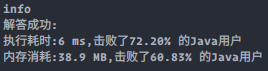

### `leetcode - 6 Z字形变换`

#### 题目描述

> 将一个给定字符串 s 根据给定的行数 numRows ，以从上往下、从左到右进行 Z 字形排列。
>
>  比如输入字符串为 "PAYPALISHIRING" 行数为 3 时，排列如下：
>
> ```
> P   A   H   N
> A P L S I I G
> Y   I   R
> ```
>
>  之后，你的输出需要从左往右逐行读取，产生出一个新的字符串，比如："PAHNAPLSIIGYIR"。
>
>  请你实现这个将字符串进行指定行数变换的函数：
>
> `string convert(string s, int numRows);`
>
> 
>
> *    示例 1：
>     *   输入：s = "PAYPALISHIRING", numRows = 3
>     *   输出："PAHNAPLSIIGYIR"
>
> *   示例 2：
>
>     *   输入：s = "PAYPALISHIRING", numRows = 4
>
>     *   输出："PINALSIGYAHRPI"
>
>     *   解释：
>
>         ```
>         P     I    N
>         A   L S  I G
>         Y A   H R
>         P     I
>         ```
>
> *    示例 3：
>     *   输入：s = "A", numRows = 1
>     *   输出："A"
>
> 
>
> *    提示：
>     *    1 <= s.length <= 1000
>     *    s 由英文字母（小写和大写）、',' 和 '.' 组成
>     *    1 <= numRows <= 1000
>
> *    Related Topics 字符串
> *    👍 1221 👎 0

#### 我的题解

```java
/**
 * 模拟题，用numRows个字符串来代表每行的字符排列，用一个指针代表当前字符按Z形排列后所在的行
 * 指针每走一步就将遇到的字符放到相对应行的字符串里，最后将numRows个字符串拼接在一起即可
 */

public class Solution6 implements Solution<String> {
    @Override
    public String solute() {
        return convert("PAYPALISHIRING", 3);
    }

    public String convert(String s, int numRows) {
        int n = s.length();
        if (n <= numRows || numRows <= 1) {
            return s;
        }
        List<StringBuilder> rowBuilderList = new ArrayList<>() {{
            for (int i = 0; i < numRows; i++) {
                add(new StringBuilder());
            }
        }};
        int crtRowIndex = 0, step = -1;
        for (int i = 0; i < n; i++) {
            rowBuilderList.get(crtRowIndex).append(s.charAt(i));
            if (crtRowIndex >= numRows - 1 || crtRowIndex <= 0) {
                step *= -1;
            }
            crtRowIndex += step;
        }
        StringBuilder ansBuilder = new StringBuilder();
        rowBuilderList.forEach(it -> ansBuilder.append(it.toString()));
        return ansBuilder.toString();
    }
}
```

