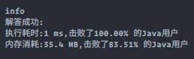

### `leetcode - 7 整数反转`

#### 题目描述

> 给你一个 32 位的有符号整数 x ，返回将 x 中的数字部分反转后的结果。
>
>  如果反转后整数超过 32 位的有符号整数的范围 [−231, 231 − 1] ，就返回 0。
> 假设环境不允许存储 64 位整数（有符号或无符号）。
>
> 
>
> *   示例 1：
>     *   输入：x = 123
>     *   输出：321
>
> *    示例 2：
>     *   输入：x = -123
>     *   输出：-321
>
> *    示例 3：
>     *   输入：x = 120
>     *   输出：21
>
> *    示例 4：
>     *   输入：x = 0
>     *   输出：0
>
> 
>
> *    提示：
>     *    -231 <= x <= 231 - 1
>
> *    Related Topics 数学
> *    👍 2958 👎 0

#### 我的题解

```java
/**
 * 整数反转，要求结果超出Integer范围则返回0
 * 
 */

class Solution {
    public int reverse(int x) {
        int maxTen = Integer.MAX_VALUE / 10, minTen = Integer.MIN_VALUE / 10;
        int ans = 0;

        while (x != 0) {
            int tmp = x % 10;
            if ((ans > maxTen || (ans == maxTen && tmp > 7))
                    || (ans < minTen || (ans == minTen && tmp < -8))) {
                return 0;
            }
            ans = ans * 10 + tmp;
            x /= 10;
        }

        return ans;
    }
}
```

