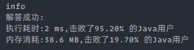

### `leetcode - 8 字符串转换整数`

#### 题目描述

> 请你来实现一个 myAtoi(string s) 函数，使其能将字符串转换成一个 32 位有符号整数（类似 C/C++ 中的 atoi 函数）。
>
> 函数 myAtoi(string s) 的算法如下：
>
> >   *   读入字符串并丢弃无用的前导空格
> >   *   检查下一个字符（假设还未到字符末尾）为正还是负号，读取该字符（如果有）。 确定最终结果是负数还是正数。 如果两者都不存在，则假定结果为正。
> >   *   读入下一个字符，直到到达下一个非数字字符或到达输入的结尾。字符串的其余部分将被忽略。
> >   *   将前面步骤读入的这些数字转换为整数（即，"123" -> 123， "0032" -> 32）。如果没有读入数字，则整数为 0 。必要时更改符号（从步骤2 开始）。
> >   *   如果整数数超过 32 位有符号整数范围 [−231, 231 − 1] ，需要截断这个整数，使其保持在这个范围内。具体来说，小于 −231 的整数应该被固定为 −231 ，大于 231 − 1 的整数应该被固定为 231 − 1 。
> >   *   返回整数作为最终结果。
>
> *    注意：
>     *   本题中的空白字符只包括空格字符 ' ' 。
>     *   除前导空格或数字后的其余字符串外，请勿忽略任何其他字符。
>
> 
>
> *   示例 1：
>
>     ```
>     输入：s = "42"
>     输出：42
>     解释：加粗的字符串为已经读入的字符，插入符号是当前读取的字符。
>     第 1 步："42"（当前没有读入字符，因为没有前导空格）
>              ^
>     第 2 步："42"（当前没有读入字符，因为这里不存在 '-' 或者 '+'）
>              ^
>     第 3 步："42"（读入 "42"）
>                ^
>     解析得到整数 42 。
>     由于 "42" 在范围 [-231, 231 - 1] 内，最终结果为 42 。
>     ```
>
> *    示例 2：
>
>      ```
>      输入：s = "   -42"
>      输出：-42
>      解释：
>      第 1 步："   -42"（读入前导空格，但忽视掉）
>                  ^
>      第 2 步："   -42"（读入 '-' 字符，所以结果应该是负数）
>                   ^
>      第 3 步："   -42"（读入 "42"）
>                     ^
>      解析得到整数 -42 。
>      由于 "-42" 在范围 [-231, 231 - 1] 内，最终结果为 -42 。
>      ```
>
> *    示例 3：
>
>      ```
>      输入：s = "4193 with words"
>      输出：4193
>      解释：
>      第 1 步："4193 with words"（当前没有读入字符，因为没有前导空格）
>               ^
>      第 2 步："4193 with words"（当前没有读入字符，因为这里不存在 '-' 或者 '+'）
>               ^
>      第 3 步："4193 with words"（读入 "4193"；由于下一个字符不是一个数字，所以读入停止）
>                   ^
>      解析得到整数 4193 。
>      由于 "4193" 在范围 [-231, 231 - 1] 内，最终结果为 4193 。
>      ```
>
> *    示例 4：
>
>      ```
>      输入：s = "words and 987"
>      输出：0
>      解释：
>      第 1 步："words and 987"（当前没有读入字符，因为没有前导空格）
>               ^
>      第 2 步："words and 987"（当前没有读入字符，因为这里不存在 '-' 或者 '+'）
>               ^
>      第 3 步："words and 987"（由于当前字符 'w' 不是一个数字，所以读入停止）
>               ^
>      解析得到整数 0 ，因为没有读入任何数字。
>      由于 0 在范围 [-231, 231 - 1] 内，最终结果为 0 。
>      ```
>
> *   示例 5：
>
>     ```
>     输入：s = "-91283472332"
>     输出：-2147483648
>     解释：
>     第 1 步："-91283472332"（当前没有读入字符，因为没有前导空格）
>              ^
>     第 2 步："-91283472332"（读入 '-' 字符，所以结果应该是负数）
>               ^
>     第 3 步："-91283472332"（读入 "91283472332"）
>                          ^
>     解析得到整数 -91283472332 。
>     由于 -91283472332 小于范围 [-231, 231 - 1] 的下界，最终结果被截断为 -231 = -2147483648 。
>     ```
>
>
> 
>
> *   提示：
>     *   `0 <= s.length <= 200`
>     *   s 由英文字母（大写和小写）、数字（`0-9`）、`' '`、`'+'`、`'-'` 和 `'.'` 组成
>
> *    Related Topics 字符串
> *    👍 1168 👎 0

#### 我的题解

```java
class Solution {
    public int myAtoi(String s) {
        if (s == null || "".equals(s.trim())) {
            return 0;
        }
        int ans = 0, i = 0, sign = 1;
        int maxTen = Integer.MAX_VALUE / 10, minTen = Integer.MIN_VALUE / 10;
        // 去前缀零
        s = s.trim();

        // 预处理，有符号位则循环从第二位开始，有除数字和符号位外的字符直接返回0
        if (s.charAt(0) == '-') {
            sign = -1;
            i = 1;
        } else if (s.charAt(0) == '+') {
            sign = 1;
            i = 1;
        } else if (!isNumber(s.charAt(0))) {
            return ans;
        }

        for (; i < s.length(); i++) {
            char c = s.charAt(i);

            if (isNumber(c)) {
                // 状态1：遇到数字
                int tmp = c - '0';
                if (ans * sign > maxTen || (ans * sign == maxTen && tmp > 7)) {
                    return Integer.MAX_VALUE;
                } else if (ans * sign < minTen || (ans * sign == minTen && tmp > 8)) {
                    return Integer.MIN_VALUE;
                }
                ans = ans * 10 + tmp;
            } else {
                // 状态2：遇到其他任何字符
                break;
            }
        }

        return ans * sign;
    }

    private boolean isNumber(char c) {
        return c >= '0' && c <= '9';
    }
}
```


