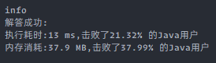

### `题目`

#### 题目描述

> 给你一个整数 x ，如果 x 是一个回文整数，返回 true ；否则，返回 false 。
>
>  回文数是指正序（从左向右）和倒序（从右向左）读都是一样的整数。例如，121 是回文，而 123 不是。
>
> ​        
>
> *    示例 1：
>
>     ```
>     输入：x = 121
>     输出：true
>     ```
>
> *    示例 2：
>
>     ```
>     输入：x = -121
>     输出：false
>     解释：从左向右读, 为 -121 。 从右向左读, 为 121- 。因此它不是一个回文数。
>     ```
>
> *    示例 3：
>
>     ```
>     输入：x = 10
>     输出：false
>     解释：从右向左读, 为 01 。因此它不是一个回文数。
>     ```
>
> *    示例 4：
>
>     ```
>     输入：x = -101
>     输出：false
>     ```
>
> 
>
> *    提示：
>
> `-2^31 <= x <= 2^31 - 1`
>
> 
>
> *    进阶：你能不将整数转为字符串来解决这个问题吗？
> *    Related Topics 数学
> *    👍 1568 👎 0

#### 我的题解

```java
class Solution {
    public boolean isPalindrome(int x) {
        if (x < 0) {
            return false;
        }
        if (x < 10) {
            return true;
        }
        // 求位数
        int count = (int) (Math.log10(x) + 1);
        for (int i = 0; i < count / 2; i++) {
            int top = (int) (x % Math.pow(10, count - i) / Math.pow(10, count - i - 1));
            int bottom = (int) (x % Math.pow(10, i + 1) / Math.pow(10, i));
            if (top != bottom) {
                return false;
            }
        }
        return true;
    }
}
```



#### 可改进的点

> * 上面的方法是把头和尾的每一位拿出来比较，实际上可以直接将数值对半分开，取一方反转后查看两边是否相等（奇数位不算中间的数）

#### 改进

```java
// 待补充
```
